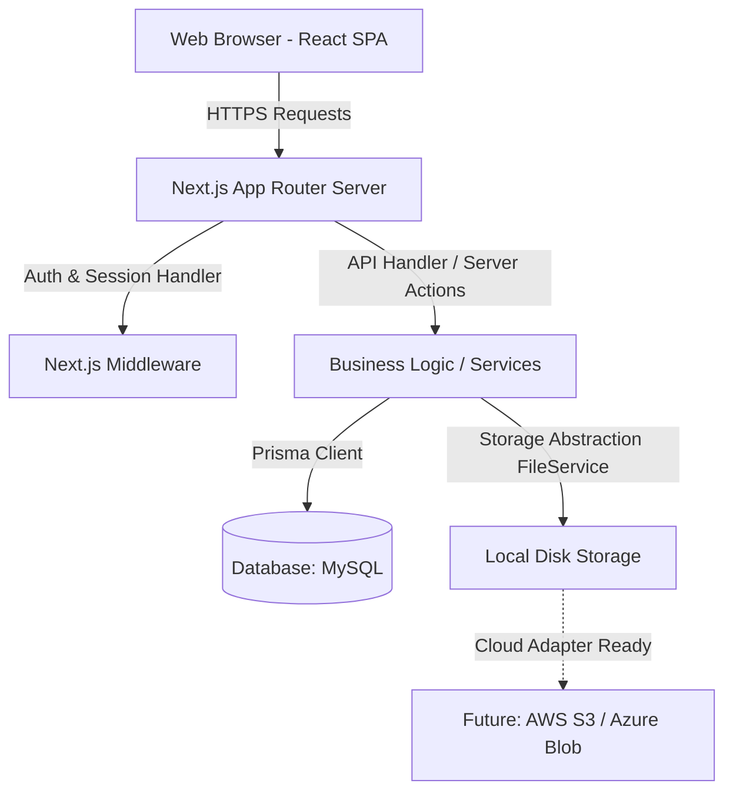

# Construction Management System (CMS) - Technical Design & Implementation Plan

This implementation plan outlines the requirements, architectural design, database schema, role-based workflows, and development roadmap for a comprehensive, production-ready Construction Management System (CMS).

---

## 1. System Architecture & Tech Stack

The system is built as a full-stack application using **Next.js** (App Router).

### Core Architecture


### Stack Selections
*   **Frontend**: Next.js 14+ (React 18+, TypeScript)
*   **Styling**: Vanilla CSS with **CSS Modules** for component-level modularity and global CSS variables for design system tokens (colors, gradients, typography, transitions).
*   **Backend & APIs**: Next.js Route Handlers (REST APIs) and React Server Actions.
*   **Database**: **MySQL** from the start, integrated via **Prisma ORM**.
*   **Authentication**: Custom session management or Next-Auth for secure, role-based page and API route access.
*   **File Uploads**: A modular `FileService` interface that writes to local disk for development, designed to easily swap in cloud-storage providers (S3/Azure Blob) later.

---

## 2. Role-Based Access Control (RBAC) Matrix

The system will enforce strict permissions based on the following roles:

| Module / Resource | System Admin | General Manager (GM) | Deputy GM (DGM) | VP of Construction | Project Manager (PM) | Site Engineer (SE) |
| :--- | :---: | :---: | :---: | :---: | :---: | :---: |
| **User/Staff Management** | CRUD | R | R | R | R (Project Staff) | None |
| **Project Creation/Budgets**| CRUD | CRUD | CRUD | CRUD | R | R |
| **Milestones & Schedules** | CRUD | CRUD | CRUD | CRUD | CRUD | R (Updates progress) |
| **Work Orders (Tasks)** | CRUD | R | R | CRUD (Assign) | CRUD (Assign) | R (Update status) |
| **Change Orders** | CRUD | Approve/Reject | Approve/Reject | Review/Verify | Create / Request | R |
| **Inventory & Materials** | CRUD | R | R | R | CRUD (Request) | CRUD (Log usage) |
| **Daily Site Reports** | R | R | R | R (Verify) | Review & Approve | Create / Log |
| **Weekly/Monthly Reports** | R | R | R | R | Compile & Edit | R (Draft summaries) |
| **Analytics Dashboard** | Full System | Full Org | Full Org | Department/Region | Project Specific | Personal/Site Spec |

*   **CRUD**: Create, Read, Update, Delete.
*   **R**: Read-Only.

---

## 3. Core Database Schema Design (Prisma Model - MySQL)

The database configuration utilizes MySQL. A new `SummaryReport` model is added to compile Weekly and Monthly reports with customizable Project Manager commentary.

```prisma
datasource db {
  provider = "mysql"
  url      = env("DATABASE_URL")
}

generator client {
  provider = "prisma-client-js"
}

enum Role {
  SYSTEM_ADMIN
  GENERAL_MANAGER
  DEPUTY_GENERAL_MANAGER
  VP_OF_CONSTRUCTION
  PROJECT_MANAGER
  SITE_ENGINEER
}

enum ProjectStatus {
  PLANNING
  ACTIVE
  ON_HOLD
  COMPLETED
  CANCELLED
}

enum OrderStatus {
  DRAFT
  PENDING_APPROVAL
  APPROVED
  REJECTED
  IN_PROGRESS
  COMPLETED
}

model User {
  id            String         @id @default(uuid())
  email         String         @unique
  passwordHash  String
  firstName     String
  lastName      String
  phone         String?
  role          Role
  isActive      Boolean        @default(true)
  createdAt     DateTime       @default(now())
  updatedAt     DateTime       @updatedAt

  // Relationships
  managedProjects Project[]    @relation("ProjectManager")
  siteProjects    Project[]    @relation("SiteEngineers")
  assignedTasks   Task[]       @relation("TaskAssignee")
  createdTasks    Task[]       @relation("TaskCreator")
  reportsSubmitted DailyReport[] @relation("ReportSubmitter")
  changeOrdersCreated ChangeOrder[] @relation("ChangeOrderRequester")
  changeOrdersApproved ChangeOrder[] @relation("ChangeOrderApprover")
  summaryReports   SummaryReport[] @relation("ReportCompiler")
}

model Project {
  id          String        @id @default(uuid())
  name        String
  code        String        @unique // Short project code (e.g., PRJ-2026-001)
  description String?       @db.Text
  location    String
  startDate   DateTime
  endDate     DateTime?
  status      ProjectStatus @default(PLANNING)
  budget      Float         @default(0.0)
  createdAt   DateTime      @default(now())
  updatedAt   DateTime      @updatedAt

  // Manager and Engineers
  managerId   String
  manager     User          @relation("ProjectManager", fields: [managerId], references: [id])
  engineers   User[]        @relation("SiteEngineers")

  // Sub-modules
  milestones  Milestone[]
  tasks       Task[]
  changeOrders ChangeOrder[]
  materials   MaterialAllocation[]
  documents   Document[]
  dailyReports DailyReport[]
  summaryReports SummaryReport[]
}

model Milestone {
  id          String    @id @default(uuid())
  title       String
  description String?   @db.Text
  dueDate     DateTime
  isCompleted Boolean   @default(false)
  projectId   String
  project     Project   @relation(fields: [projectId], references: [id], onDelete: Cascade)
  createdAt   DateTime  @default(now())
  updatedAt   DateTime  @updatedAt
}

model Task {
  id          String      @id @default(uuid())
  title       String
  description String?     @db.Text
  dueDate     DateTime
  status      OrderStatus @default(DRAFT)
  type        String      @default("WORK_ORDER") // "WORK_ORDER" or "CHANGE_ORDER_TASK"
  progress    Int         @default(0) // 0-100 percentage
  
  projectId   String
  project     Project     @relation(fields: [projectId], references: [id], onDelete: Cascade)
  
  assigneeId  String?
  assignee    User?       @relation("TaskAssignee", fields: [assigneeId], references: [id])
  
  creatorId   String
  creator     User        @relation("TaskCreator", fields: [creatorId], references: [id])

  createdAt   DateTime    @default(now())
  updatedAt   DateTime    @updatedAt
}

model ChangeOrder {
  id             String      @id @default(uuid())
  title          String
  description    String      @db.Text
  estimatedCost  Float
  status         OrderStatus @default(PENDING_APPROVAL)
  rejectionReason String?    @db.Text

  projectId      String
  project        Project     @relation(fields: [projectId], references: [id], onDelete: Cascade)

  requesterId    String
  requester      User        @relation("ChangeOrderRequester", fields: [requesterId], references: [id])

  approverId     String?
  approver       User?       @relation("ChangeOrderApprover", fields: [approverId], references: [id])

  createdAt      DateTime    @default(now())
  updatedAt      DateTime    @updatedAt
}

model Material {
  id          String               @id @default(uuid())
  name        String               @unique
  unit        String               // e.g., "bags", "tons", "meters"
  stockCount  Float                @default(0.0)
  minStock    Float                @default(0.0) // Reorder threshold
  allocations MaterialAllocation[]
  logs        MaterialLog[]
}

model MaterialAllocation {
  id          String   @id @default(uuid())
  projectId   String
  project     Project  @relation(fields: [projectId], references: [id], onDelete: Cascade)
  materialId  String
  material    Material @relation(fields: [materialId], references: [id])
  allocatedQty Float
  consumedQty  Float   @default(0.0)
  createdAt   DateTime @default(now())
  updatedAt   DateTime @updatedAt
}

model MaterialLog {
  id          String   @id @default(uuid())
  materialId  String
  material    Material @relation(fields: [materialId], references: [id], onDelete: Cascade)
  quantity    Float    // positive for restock, negative for deduction
  actionType  String   // "STOCK_IN", "STOCK_OUT", "DAILY_REPORT_CONSUMPTION"
  referenceId String?  // Optional relation to DailyReport or PurchaseOrder
  createdAt   DateTime @default(now())
}

model Document {
  id          String   @id @default(uuid())
  title       String
  fileUrl     String
  fileType    String   // "DRAWING", "CONTRACT", "REPORT", "IMAGE", "PDF"
  fileSize    Int
  projectId   String
  project     Project  @relation(fields: [projectId], references: [id], onDelete: Cascade)
  uploadedBy  String   // User display name or ID
  createdAt   DateTime @default(now())
}

model DailyReport {
  id             String            @id @default(uuid())
  reportDate     DateTime          // The operational date this report represents
  workCompleted  String            @db.Text
  issuesFaced    String?           @db.Text
  weather        String?
  
  projectId      String
  project        Project           @relation(fields: [projectId], references: [id], onDelete: Cascade)
  
  submitterId    String
  submitter      User              @relation("ReportSubmitter", fields: [submitterId], references: [id])
  
  isApproved     Boolean           @default(false)
  approvedBy     String?

  photos         ReportPhoto[]
  materialUsage  ReportMaterialUsage[]
  
  createdAt      DateTime          @default(now())
  updatedAt      DateTime          @updatedAt

  @@unique([projectId, reportDate]) // One daily report per project per day
}

model ReportPhoto {
  id            String      @id @default(uuid())
  fileUrl       String
  caption       String?
  dailyReportId String
  dailyReport   DailyReport @relation(fields: [dailyReportId], references: [id], onDelete: Cascade)
}

model ReportMaterialUsage {
  id            String      @id @default(uuid())
  dailyReportId String
  dailyReport   DailyReport @relation(fields: [dailyReportId], references: [id], onDelete: Cascade)
  materialName  String      // Store name directly to guard against material deletion histories
  quantityUsed  Float
}

model SummaryReport {
  id           String    @id @default(uuid())
  title        String    // e.g., "Weekly Report - Week 23 (2026)" or "Monthly Report - May"
  reportType   String    // "WEEKLY" or "MONTHLY"
  startDate    DateTime
  endDate      DateTime
  commentary   String?   @db.Text // Custom feedback/commentary input by PM before compilation
  
  projectId    String
  project      Project   @relation(fields: [projectId], references: [id], onDelete: Cascade)
  
  compilerId   String
  compiler     User      @relation("ReportCompiler", fields: [compilerId], references: [id])
  
  createdAt    DateTime  @default(now())
  updatedAt    DateTime  @updatedAt
}
```

---

## 4. Key Business Workflows

### 4.1. Daily Site Report to Weekly/Monthly Summary Compilation
1.  **Site Engineers** log work summaries, weather, and photos daily.
2.  **Project Managers** review and approve daily reports.
3.  When a **Weekly/Monthly Report** is initiated:
    *   The system aggregates all approved daily report items (work completed, issues faced, materials consumed) within the date range.
    *   The project manager reviews the compiled data.
    *   The PM enters descriptive **commentary** (e.g., explaining deviations, highlighting milestones, calling out material constraints) in the `SummaryReport` model.
    *   The PM saves and generates the final PDF/dashboard view.

---

## 5. Development Roadmap (Phases)

```
┌────────────────────────────────────────────────────────┐
│ Phase 1: Core System & Auth Setup                      │
│ - Initialize Next.js project with standard directory    │
│ - Configure Prisma ORM with MySQL connection           │
│ - Database migration, User management & Login (RBAC)   │
└──────────────────────────┬─────────────────────────────┘
                           ▼
┌────────────────────────────────────────────────────────┐
│ Phase 2: Project, Task & Document Management           │
│ - Projects creation, Milestones (Gantt-like UI)        │
│ - Work Orders, Change Orders, Local file storage       │
└──────────────────────────┬─────────────────────────────┘
                           ▼
┌────────────────────────────────────────────────────────┐
│ Phase 3: Inventory & Daily Reports                     │
│ - Inventory tracking, project material allocations     │
│ - Daily reports (Mobile-responsive logs, photos)       │
│ - Weekly/monthly compilation engine with PM commentary │
└──────────────────────────┬─────────────────────────────┘
                           ▼
┌────────────────────────────────────────────────────────┐
│ Phase 4: Dashboards, Analytics & Polish                │
│ - Executive, PM, and Engineer customized landing dashboards│
│ - Financial reports, performance charts, animations     │
└────────────────────────────────────────────────────────┘
```

---

## 6. User Verification Plan

### Automated Database & API Tests
*   We will run validation scripts to verify database seeding and connection.
*   API integration tests will verify role restriction middleware.

### Manual Verification
*   We will check file upload routing to ensure drawings and images save locally to the public directory (with paths saved in MySQL).
*   We will mock multiple site reports to confirm the compilation algorithm.
